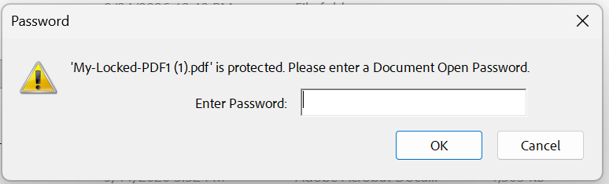
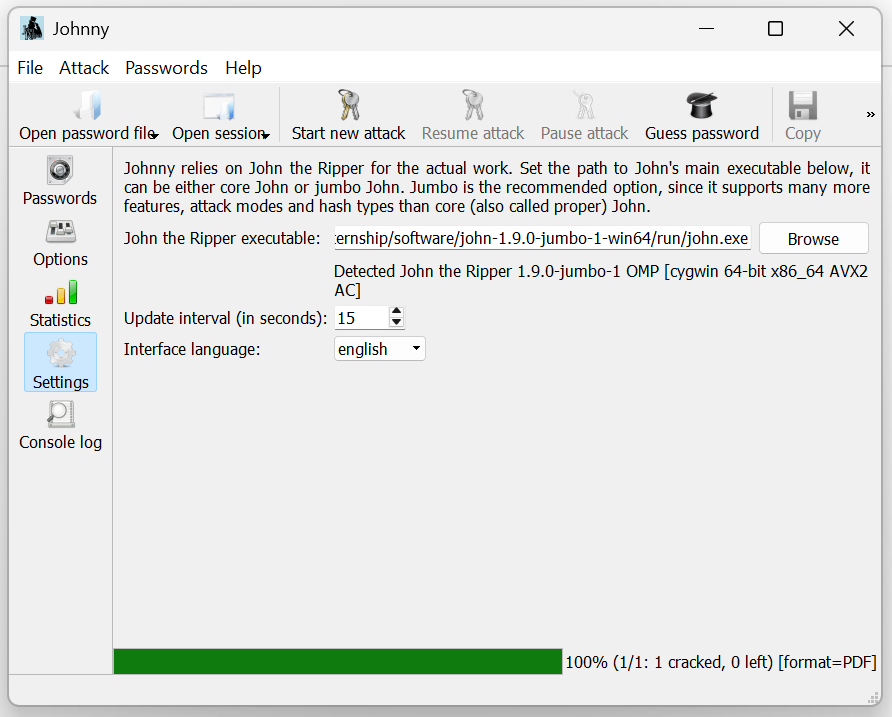
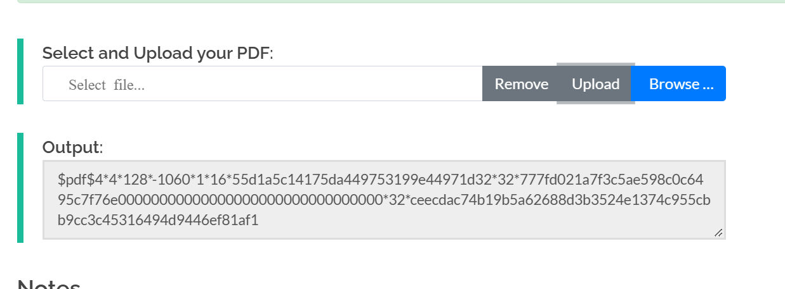
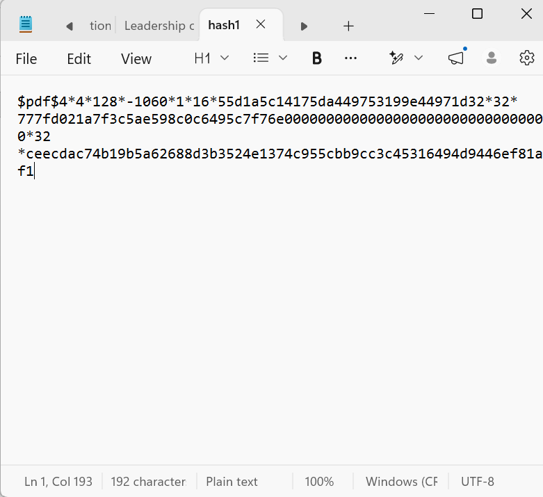
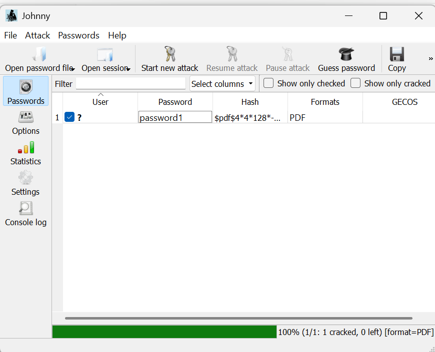
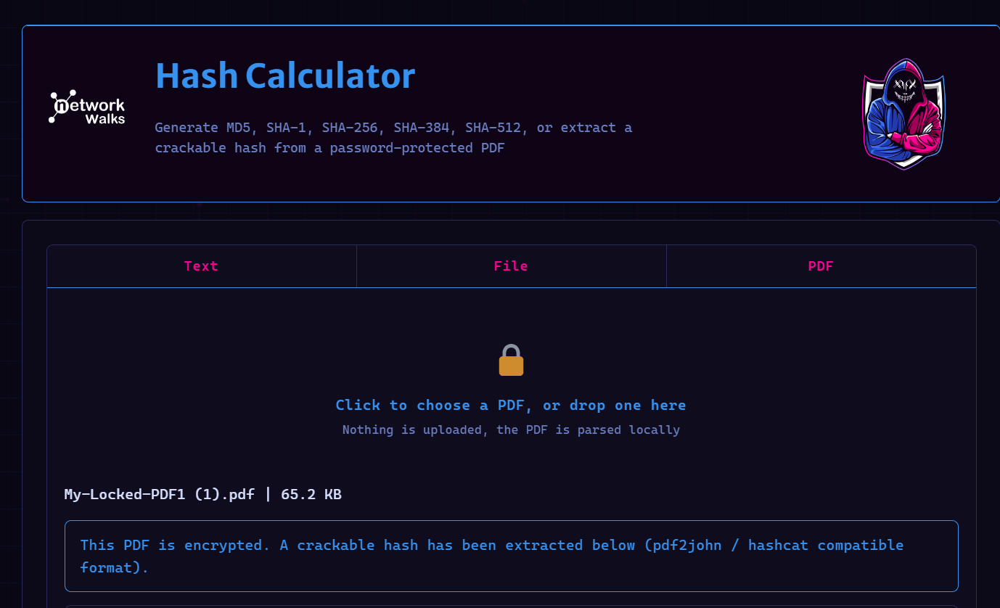
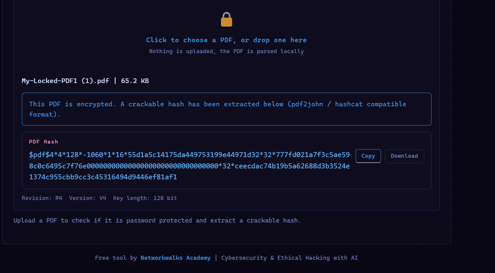
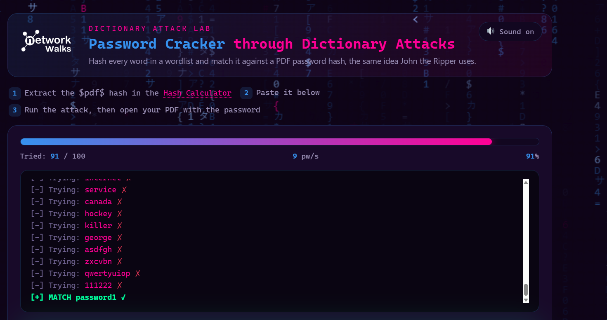
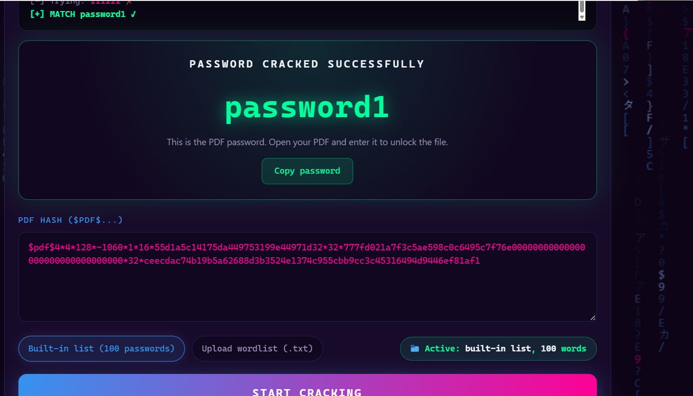

# NETWORKWALKS-B083-ABISOLA-WK3-PM1-PASSWORD-CRACKING
Password Cracking with John the Ripper (JTR) and Networkwalks Tools
# WEEK 3 PROJECT REPORT

## Password Cracking with John the Ripper (JTR) and Networkwalks Tools

**Training:** Networkwalks Cybersecurity & Ethical Hacking Project
**Week:** 3
**Project Modules:**

* W3-PM1: Password Cracking with JTR
* W3-PM2: Password Cracking with Networkwalks Tools

---

## 1. Introduction

As part of Week 3 of my cybersecurity practical training, I completed two password-cracking laboratory exercises designed to demonstrate how password-protected files can be assessed using ethical password-recovery techniques.

The two practical modules were:

1. **W3-PM1 – Password Cracking with JTR (John the Ripper)**
2. **W3-PM2 – Password Cracking with Networkwalks Tools**

The exercises involved working with a password-protected PDF provided specifically for the lab. The objective was to extract the password hash from the protected file and use password-cracking tools to recover the original password.

These exercises helped me understand the relationship between password protection, hashing, password strength, wordlists, and password-cracking tools.

> **Ethical Note:** The techniques demonstrated in this project were performed only on the lab files provided for the training exercise. Password-cracking tools should only be used on systems, files, or credentials that are owned by the tester or where explicit authorization has been granted.

---

# 2. Project Objectives

The objectives of this week's project were to:

* Understand the basic concept of password cracking.
* Understand how password-protected PDF files can be assessed.
* Extract a password hash from a protected PDF.
* Use John the Ripper to perform password recovery.
* Understand the use of the Johnny graphical interface.
* Use browser-based Networkwalks password-cracking tools.
* Observe how password complexity affects cracking time.
* Successfully recover the password of the authorized lab PDF.
* Understand the importance of strong passwords and secure password practices.

---

# 3. W3-PM1: Password Cracking with JTR

## 3.1 Overview

John the Ripper (JTR) is a password-security auditing and password-recovery tool commonly used by security professionals to test password strength.

For this project, I used the JTR/Johnny environment to recover the password of the authorized password-protected PDF supplied by Networkwalks.

The Networkwalks task explains that Johnny provides a graphical interface for John the Ripper, making the password-cracking process easier to perform for beginners. The exercise can also be performed on Windows, while John the Ripper is available by default on Kali Linux.

---

## 3.2 Tools Used

* John the Ripper (JTR)
* Johnny GUI
* Windows operating system
* Password-protected PDF supplied for the lab
* PDF hash extraction tool
* Notepad/text editor

---

## 3.3 Methodology

### Step 1 – Obtain the Password-Protected PDF

I downloaded the password-protected PDF supplied as part of the Networkwalks Week 3 project.

**Screenshot 1: Downloaded/available protected PDF**

---

### Step 2 – Configure John the Ripper / Johnny

I installed/opened Johnny and configured it to use the appropriate `john.exe` executable from the John the Ripper installation.

The `john.exe` file is located within the JTR `run` directory.

**Screenshot 2: Johnny configuration showing john.exe**

---

### Step 3 – Extract the PDF Hash

The protected PDF was processed using a PDF hash extraction tool to obtain the hash required by John the Ripper.

The extracted hash was checked to ensure it was in the expected PDF hash format beginning with:

`$pdf$...`

**Screenshot 3: Extracted PDF hash**

> For security and presentation purposes, the full hash can be partially redacted in the public GitHub repository if necessary.

---

### Step 4 – Save the Hash

The extracted hash was copied into a text file and saved as:

`hash1.txt`

This file was then supplied to Johnny as the password/hash file for the attack.

**Screenshot 4: hash1.txt containing the extracted hash**

---

### Step 5 – Start the Password Recovery Process

In Johnny, I opened the `hash1.txt` file and initiated a new password attack.

John the Ripper then attempted to identify the password corresponding to the supplied hash.

**Screenshot 5: Johnny attack in progress**

---

### Step 6 – Recover the Password

The password was successfully recovered by the tool.

**Screenshot 6: Successfully recovered password**

For this lab, the recovered password was:

**`password1`**

---

### Step 7 – Verify the Recovered Password

I used the recovered password to open the protected PDF.

The document opened successfully, confirming that the recovered password was correct.

**Screenshot 7: Successfully opened PDF**

---

## 3.4 Result

The JTR exercise was successfully completed.

I was able to:

* Extract the PDF hash.
* Prepare the hash for John the Ripper.
* Load the hash into Johnny.
* Start the password recovery process.
* Recover the password.
* Verify the recovered password by opening the protected PDF.

---

# 4. W3-PM2: Password Cracking with Networkwalks Tools

## 4.1 Overview

The second practical exercise involved using Networkwalks' browser-based password-cracking tools.

Unlike the JTR exercise, this method did not require installing a password-cracking application. The lab used two browser-based tools:

* Networkwalks Hash Calculator
* Networkwalks Password Cracker

The purpose was to extract the hash from the protected PDF and submit the hash to the password-cracking tool.

---

## 4.2 Tools Used

* Web browser
* Networkwalks Hash Calculator
* Networkwalks Password Cracker
* Password-protected PDF supplied for the lab

---

## 4.3 Methodology

### Step 1 – Access the Networkwalks Hash Calculator

I opened the Networkwalks Hash Calculator in a web browser.

The protected PDF was uploaded to the tool so that its password hash could be extracted.

**Screenshot 8: Networkwalks Hash Calculator**

---

### Step 2 – Extract the PDF Hash

After uploading the PDF, the tool generated the corresponding PDF hash.

The generated hash began with the expected `$pdf$` format.

**Screenshot 9: Generated PDF hash**

---

### Step 3 – Copy the Complete Hash

I copied the complete hash value generated by the Hash Calculator.

It was important to copy the entire hash without omitting any characters.

**Screenshot 10: Copied hash**

---

### Step 4 – Access the Password Cracker

I opened the Networkwalks Password Cracker and entered the extracted PDF hash.

**Screenshot 11: Networkwalks Password Cracker**

---

### Step 5 – Start the Password-Cracking Process

The password-cracking process was initiated after submitting the hash.

The tool attempted different password values until it identified a matching password.

**Screenshot 12: Password-cracking process**

---

### Step 6 – Recover the Password

The tool successfully identified the password for the protected PDF.

The recovered password was:

**`password1`**

**Screenshot 13: Recovered password**

---

### Step 7 – Verify the Password

I entered the recovered password into the protected PDF.

The PDF opened successfully, confirming that the password recovered by the Networkwalks tool was correct.

**Screenshot 14: Successfully opened PDF**

---

# 5. Comparison of the Two Approaches

| Feature           | JTR / Johnny                       | Networkwalks Tools                              |
| ----------------- | ---------------------------------- | ----------------------------------------------- |
| Environment       | Local application                  | Web browser                                     |
| Installation      | Required for Windows               | Not required                                    |
| Main Tool         | John the Ripper / Johnny           | Networkwalks Hash Calculator & Password Cracker |
| Hash Extraction   | External PDF hash extraction       | Networkwalks Hash Calculator                    |
| User Interface    | Command-line/GUI                   | Browser-based                                   |
| Learning Focus    | Practical password auditing        | Simplified browser-based password recovery      |
| Technical Control | Greater control over configuration | More simplified                                 |
| Result            | Password successfully recovered    | Password successfully recovered                 |

Both approaches demonstrated the same fundamental concept: a password-protected file can be assessed by obtaining the relevant hash and attempting to recover the original password through systematic password testing.

---

# 6. Key Lessons Learned

Through these exercises, I learned that:

### 1. Password hashes are important security artifacts

Password-cracking tools generally work against a representation of the password, such as a hash, rather than simply reading the original password from the protected file.

### 2. Weak passwords are vulnerable

The successful recovery of the lab password demonstrated how a simple/common password can potentially be discovered through automated password testing.

### 3. Password complexity matters

The complexity and length of a password can significantly affect the time and resources required to recover it.

### 4. Security tools require proper authorization

Password-cracking tools have legitimate cybersecurity applications, including security auditing, penetration testing, incident response, and password-strength assessment. However, they should only be used against authorized targets.

### 5. Different tools provide different levels of control

John the Ripper provides a more hands-on environment for security testing, while browser-based tools can simplify the process for beginners.

### 6. Password security should be proactive

Organizations should enforce strong password policies, encourage unique passwords, use multi-factor authentication where possible, and protect password hashes from unauthorized access.

---

# 7. Challenges Encountered

During the practical exercise, I encountered/considered the following challenges:

* Configuring John the Ripper/Johnny correctly.
* Locating the appropriate `john.exe` executable.
* Ensuring that the extracted hash was copied completely.
* Understanding the required PDF hash format.
* Waiting for the password-cracking process to complete.
* Verifying the recovered password against the protected PDF.

These challenges improved my troubleshooting skills and gave me practical exposure to how cybersecurity tools behave during security testing.

---

# 8. Security and Ethical Considerations

Password cracking should only be performed in controlled and authorized environments.

For this project, the password-protected PDF was supplied specifically for the Networkwalks training exercise. No unauthorized account, system, or third-party file was targeted.

In a professional cybersecurity environment, written authorization and a clearly defined scope should be established before performing password audits or penetration-testing activities.

---

# 9. Conclusion

Week 3 provided practical exposure to password security and password recovery techniques.

I successfully completed both project modules:

* **W3-PM1: Password Cracking with JTR**
* **W3-PM2: Password Cracking with Networkwalks Tools**

The practical exercises demonstrated the process of extracting a password hash, submitting it to a password-cracking tool, recovering the password, and validating the result by opening the protected PDF.

The project strengthened my understanding of password security, hashing, security tools, troubleshooting, and the importance of strong authentication practices.

---

## 10. Evidence

The following screenshots are included as evidence of the practical work:

### JTR / Johnny

1. Protected PDF
2. Johnny configuration
3. Extracted PDF hash
4. `hash1.txt`
5. JTR attack in progress
6. Recovered password
7. Successfully opened PDF

### Networkwalks Tools

8. Hash Calculator
9. Generated PDF hash
10. Complete hash
11. Password Cracker
12. Cracking process
13. Recovered password
14. Successfully opened PDF

---

## 11. References

* Networkwalks Academy – Password Cracking with JTR
* Networkwalks Academy – Password Cracking with Networkwalks Tools
* John the Ripper / Openwall documentation

Networkwalks Week 3 Project Module 1:
https://networkwalks.com/password-cracking-with-jtr-john-the-ripper-project-task-lab/

Networkwalks Week 3 Project Module 2:
https://networkwalks.com/password-cracking-with-networkwalks-tools-project-task-lab/

---

**Project Status: COMPLETED**

**Week 3 Cybersecurity Practical Training – Password Cracking**
